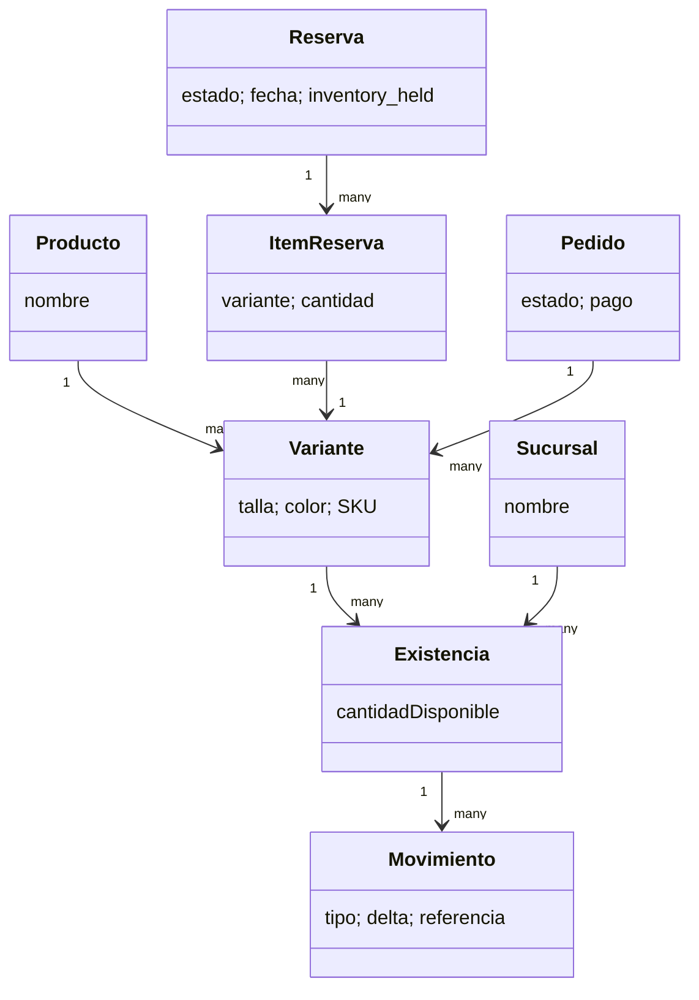

# Validación funcional para PUDS — FashionStore

Fecha: 28 de septiembre de 2026. Este registro distingue lo implementado de lo pendiente de comprobar en un dispositivo y en producción. Los tres repositorios se usan juntos: backend, frontend Angular y aplicación Flutter.

## Trazabilidad de las preguntas

| Pregunta | Estado comprobado en código | Evidencia y límite |
| --- | --- | --- |
| 3. Disponible, reservada, vendida y dos reservas simultáneas | La existencia es por variante (prenda/talla/color) y sucursal. Al reservar se registra `reservation_hold` y se descuenta la cantidad; al cancelar o atender se registra `reservation_release`. Una venta registra su propia salida. El bloqueo transaccional de la variante y del stock de sucursal impide que dos transacciones aparten la última unidad. | `StockService`, `CrearReserva`, `ActualizarEstadoReserva`; pruebas de reservas e inventario. La reserva tiene estado propio; no se guarda un único estado global “vendida” para toda la prenda. |
| 4. Compra móvil y notificación de transacción | Flutter crea pedidos y abre Checkout. El backend confirma el pago por webhook o conciliación y envía avisos por correo. | `CommerceApi`, `CarritoController`, `CommerceService`, `notificar_pedido`. No hay notificaciones push nativas implementadas. |
| 5. Stock por sucursal y contenidos de reserva | `StockModel` identifica sucursal y variante. Una reserva nueva solo admite cantidades disponibles; sus elementos quedan apartados. | `ConsultarDisponibilidad`, `CrearReserva`. Una reserva activa no puede incorporar una unidad ya vendida o apartada. |
| 6. Probador con realidad aumentada | La web y Flutter muestran cámara con seguimiento de pose y dibujo aproximado o imagen transparente preparada. | `vestidor.component.ts`, `vestidor_screen.dart`, `/vestidor/sessions`. Es una superposición 2,5D; no simula tela o talla física en 3D. Requiere recursos por color y archivos accesibles. |
| 7. Recomendaciones IA | El backend prioriza categorías de compras pagadas o prendas destacadas. | `CommerceService.recommendations`. Aún no ajusta por talla, temporada ni disponibilidad por sucursal; no corresponde declararlo completo para esas variables. |
| 8. QR, efectivo, pasarela, aprobación/rechazo | La caja admite efectivo, QR, tarjeta y transferencia. La compra web/móvil admite Stripe en modo de prueba o pago manual; Stripe puede confirmar, expirar o fallar. | `POSSale`, `CheckoutOrder`, `CommerceService.webhook`. PayPal no está implementado y el gateway exige clave `sk_test_`. |

**Cambios y devoluciones:** la devolución de un pedido entregado y pagado sí tiene solicitud, aprobación/rechazo, recepción y reposición de inventario. La devolución en caja se completa de una vez. No hay una operación de **cambio por otra talla o prenda** que enlace devolución, nueva entrega y diferencia de precio. Se confirmó que el cliente debe poder solicitar el cambio desde web y móvil. Falta definir cuándo se aparta el reemplazo y cómo se cobra o reintegra la diferencia para implementarlo sin inconsistencias.

## Diagrama de inventario



Ejemplo: sucursal A tiene 1 unidad de talla M y sucursal B tiene 2. Una reserva en A deja 0 disponibles en A y 2 en B. Una segunda reserva simultánea para esa misma unidad de A falla al consultar el stock bloqueado. Cancelar la primera devuelve la unidad a A. Una devolución de compra repone stock al completarse, después de recibir la prenda.

## Correcciones verificadas en esta revisión

- Flutter envía las devoluciones como `items: [{variant_id, quantity}]`, que es el cuerpo aceptado por la API. La prueba del controlador comprueba ese contrato.
- Las pantallas **Mis reservas** de web y móvil muestran cuando las prendas están apartadas del inventario de la sucursal, usando `inventory_held` devuelto por el backend.
- El probador Flutter entrega a ML Kit un plano NV21 en Android o BGRA8888 en iOS, transforma los puntos de píxeles a coordenadas del escenario y conserva los índices de los 33 puntos.
- La web publicada reemplaza el origen `localhost` de recursos antiguos del probador por el origen de la API de producción.
- Para imágenes nuevas, el backend usa `RAILWAY_PUBLIC_DOMAIN` cuando Railway lo proporciona y no existe una URL pública configurada expresamente.
- El backend ya no anuncia como “listo” un recurso preparado cuyo archivo local falta; responde con un motivo que indica reprocesar la prenda y revisar el almacenamiento persistente.
- Las pruebas dirigidas del backend de reservas, devoluciones, inventario y pagos pasaron: 42 casos. El conjunto completo de pruebas unitarias del probador pasó: 31 casos; las 2 pruebas nuevas de URL pública pasaron. La compilación web terminó correctamente y pasaron 19 pruebas del probador más 4 de Mis reservas. `dart analyze lib test` terminó sin hallazgos.

## Comprobación pendiente antes de aprobar producción

1. En Railway, montar un volumen persistente y apuntar `MEDIA_STORAGE_DIR` a él. Verificar que `GET /api/v1/media/files/{nombre}` devuelve la imagen tras un nuevo despliegue. Los registros en base de datos no reemplazan el archivo.
2. Preparar y aprobar al menos un recurso transparente por color que se demuestre. Una URL corregida no crea un archivo ausente.
3. En Android físico, verificar cámara frontal, seguimiento de pose, alineación del recurso y permiso de cámara. Repetir en web con una cámara real. Las pruebas automáticas no ejercitan sensores.
4. Con una cuenta de prueba de Stripe, crear un pedido desde Flutter y web, abrir Checkout, probar aprobación y rechazo/expiración, y conciliar al volver. No declarar pagos reales: el gateway actual admite solo claves de prueba.
5. Ejecutar `flutter test` y `flutter build apk --debug` en un SDK que complete las órdenes. `dart analyze lib test` sí terminó sin hallazgos; en este entorno `flutter test` quedó sin salida y se interrumpió, por eso el APK no queda aprobado.
6. Incorporar al documento PUDS principal sus capturas y resultados de ejecución. Ese documento no está en los tres repositorios examinados; esta matriz aporta las evidencias y límites para integrarlos.

La API pública de Railway no pudo consultarse desde este entorno: la conexión directa fue restringida y el navegador integrado bloqueó la navegación. Por ello no se afirma que el despliegue actual sirva imágenes, abra Stripe o refleje los cambios locales; requiere nueva comprobación después de publicar los tres repositorios.

## Comandos repetibles

Desde `backend_marketplace_moda`:

```powershell
.venv\Scripts\python.exe -m pytest -p no:cacheprovider --basetemp=tmp/pytest-validacion-puds tests\unit\reservas tests\unit\ventas_pagos\test_devoluciones.py tests\unit\ventas_pagos\test_pos_inventory.py tests\unit\ventas_pagos\test_payment_reconciliation.py tests\unit\probador_virtual\test_vestidor_contract.py tests\unit\probador_virtual\test_missing_media.py tests\unit\catalog\test_media_public_url.py -q
```

Desde `frontend_marketplace_moda`: `npm run build` y `npm run test:ci`.
Desde `mobile_marketplace_moda`: `flutter analyze`, `flutter test` y `flutter build apk --debug`.
